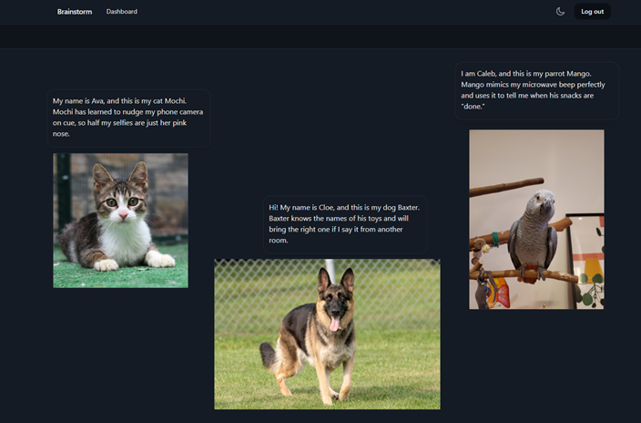

# Brainstorming Dashboard

> A Notion‑style brainstorming platform with real-time board creation, drag‑and‑drop cards, and shareable collaboration links — built using Go, React, MySQL, and Docker for a full production‑grade stack.

[](https://react.dev/)
[](https://go.dev/)
[](https://www.mysql.com/)
[](./LICENSE)

---

## 🌐 Live Demo

- **App URL:** [https://simplebrainstorm.com](https://simplebrainstorm.com)
- **Demo Credentials:** `demo@example.com` / `mypassword`
- **Demo Board (Edit Permission):** [https://simplebrainstorm.com/share/4c9cfe76f93885d8be48b3e6fc8e96b2](https://simplebrainstorm.com/share/4c9cfe76f93885d8be48b3e6fc8e96b2)
- **Portfolio:** [https://logantackett.dev](https://logantackett.dev)

| Light | Dark |
|---|---|
|  |  |

---

## 🧠 Highlights

- **End‑to‑end stack:** frontend, backend, database, and reverse proxy all containerized.
- **Scalable:** designed for deployment on AWS Lightsail or EC2.
- **Intuitive UX:** pan and zoom canvas (5000×5000), drag‑and‑drop cards, light/dark theme.
- **Collaboration:** share boards by email or link with custom permissions.

---

## ⚙️ Architecture Overview

- **Frontend:** React + Vite + Tailwind  
- **Backend:** Go REST API with JWT authentication  
- **Database:** MySQL (Dockerized)  
- **Reverse Proxy:** Caddy (serving static frontend & proxying API)  
- **Storage:** AWS S3 for board thumbnails and images  

```
[ React (Vite) ] → [ Caddy Proxy :80 ] → [ Go API :8080 ] → [ MySQL :3306 ]
                                        ↘ [ AWS S3 (assets) ]
```

---

## 🚀 Deployment Guide (AWS Lightsail + Docker)

### Prerequisites

Before deployment, ensure the following are installed and configured on your Lightsail instance:

- **Git**
- **Docker** and **Docker Compose**
- **AWS CLI** (configured with S3 access credentials)
- **Domain DNS** pointing to your Lightsail instance

---

### 1. Clone the Repository

```bash
git clone https://github.com/LoganTackett1/brainstorming-dashboard.git
cd brainstorming-dashboard
```

---

### 2. Create a `.env` File

In the project root, create a `.env` file with the following environment variables:

```env
MYSQL_ROOT_PASSWORD=your_mysql_root_password
MYSQL_USER=your_mysql_username
MYSQL_PASSWORD=your_mysql_password
DB_DSN=your_mysql_username:your_mysql_password@tcp(db:3306)/brainstorm?parseTime=true

JWT_SECRET=your_jwt_secret

AWS_REGION=us-east-1
S3_BUCKET=your_s3_bucket_name
AWS_ACCESS_KEY_ID=your_aws_access_key
AWS_SECRET_ACCESS_KEY=your_aws_secret_key
```

> ⚠️ **Important:** Never commit this file to GitHub. It should remain private on your server.

---

### 3. Build the Docker Containers

Rebuild all images from scratch to ensure clean layers:

```bash
sudo docker compose build --no-cache
```

---

### 4. Launch the Application

Run all services in detached mode:

```bash
sudo docker compose up -d
```

This will start the following services:

| Service | Description |
|----------|--------------|
| **caddy** | Serves the frontend and proxies API requests to the Go backend. |
| **api** | Go REST API handling authentication, boards, cards, and sharing logic. |
| **frontend** | React + Vite application compiled into static files served by Caddy. |
| **db** | MySQL database container storing user, board, and card data. |

Once the containers are running, visit your site at:

👉 [https://simplebrainstorm.com](https://simplebrainstorm.com)

---

### 5. Managing Containers

Check status:
```bash
sudo docker ps
```

View logs:
```bash
sudo docker compose logs -f
```

Stop the app:
```bash
sudo docker compose down
```

Rebuild with updates:
```bash
git pull origin main
sudo docker compose build --no-cache
sudo docker compose up -d
```

---

## 🧩 Local Development (Optional)

If you prefer to run the app locally without Docker:

**Backend**
```bash
cd backend
go mod download
go run ./cmd/api
```

**Frontend**
```bash
cd frontend
npm install
npm run dev
```

**Database (Dockerized)**
```bash
docker run --name brainstorm-mysql   -e MYSQL_ROOT_PASSWORD=root   -e MYSQL_DATABASE=brainstorm   -p 3306:3306   -d mysql:8
```

---

## 🧪 Testing

**Backend**
```bash
cd backend
go test ./...
```

**Frontend**
```bash
cd frontend
npm test
```

---

## 🗺️ Roadmap

- [ ] Real‑time collaboration (WebSockets)
- [ ] Board export (PNG/PDF)
- [ ] Presence indicators for shared boards
- [ ] S3 presigned upload for images
- [ ] Role management & ownership transfer

---

## 📜 License

MIT
